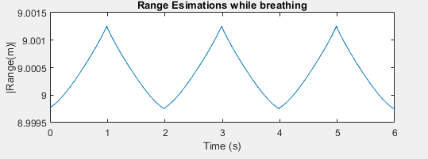
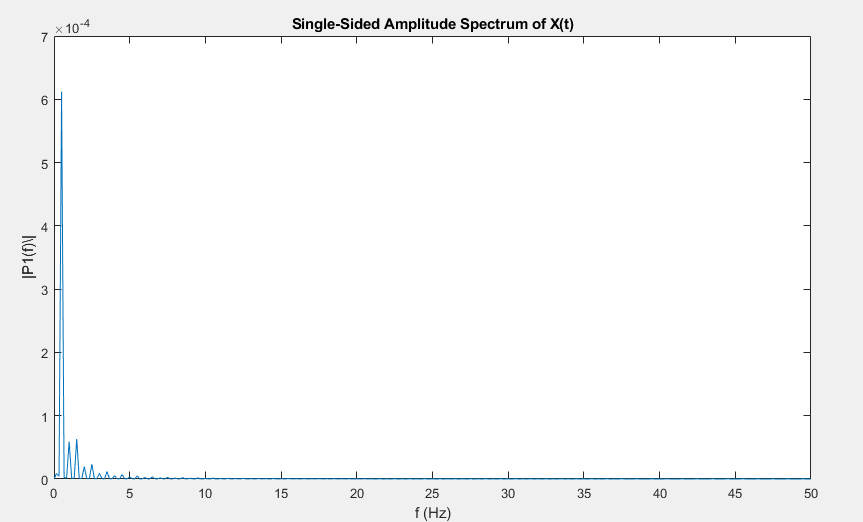

# BreathingrateMonitoringSim
This simulation is done as a summer research project bu me under the supervision of Dr.Buse Melis Ozyildirim at Çukurova University.

# Breathing rate monitoring simulation

In this work I ask whether it is possible to simulate a human breathing behavior and yet simulate FMCW radar that can detect the chest distance range over time and then provide the breathing rate by processing the reflected signals.

FMCW radar (Frequency-Modulated Continuous Wave radar = FMCW radar) is a special type of radar sensor which radiates continuous transmission power like a simple continuous wave radar (CW-Radar). In contrast to this CW radar FMCW radar can change its operating frequency during the measurement: that is, the transmission signal is modulated in frequency (or in phase).

The basic features of FMCW radar are:

    1. Ability to measure very small ranges to the target (the minimal measured range is comparable to the transmitted wavelength);

    2. Ability to measure simultaneously the target range and its relative velocity;

    3. Very high accuracy of range measurement;

    4. Signal processing after mixing is performed at a low frequency range, considerably simplifying the realization of the processing circuits;

    5. Safety from the absence of the pulse radiation with a high peak power.
    
To address the issues the project is partitioned into  5 steps:

    1. FMCW wave form determination.
    2. Target modeling.
    3. Radar system setup.
    4. Radar system simulation.
    5. Deriving an managing the results.

# FMCW waveform:

The received signal is a time-delayed copy of the transmitted signal ,
where the delay,  is related to the range. Because the signal is always sweeping through a frequency band, at any moment during the sweep, the frequency difference, is a constant between the transmitted signal and the received signal. is usually called the beat frequency. Because the sweep is linear,one can derive the time delay from the beat frequency and then translate the delay to the range.

# Some definitions:

Sampling rate:  Also called a sample rate. Typically expressed in samples per second, or hertz (Hz), the rate at which samples of an analog signal are taken in order to be converted into digital form.

Doppler frequency: is the change in frequency or wavelength of a wave in relation to an object which is moving relative to the wave source.

Beat frequency: is the frequency difference between the transmited signal and the recieved one.

In order to get the maximum doppler shift we need to know the maximum speed
Of the chest while breathing.

The normal respiration rate for an adult at rest is 12 to 20 breaths per minute. A respiration rate under 12 or over 25 breaths per minute while resting is considered abnormal according to[2].

 But it can grow up to 40 in abnormal situation like asthma. Hence the max rate we want to detect is 40 breath per second.

A normal range between inspiration and expiration is 5.8 up to 7.6 according to
[3]. I used a fixed point for my senario which is 6 cm chestwide.
The expantion of chest forword is roughly third the total expantion 6/3=2 cm
Hence, Total distance traveled in a minute is 2* repirationRate*forwordExpansion 

# Target Modelling
Modelling the target behavior is a crucial step for getting the rigth results 
And that is done by determinig the radar cross section(RCS).

Radar cross section:  is the measure of targets ability to reflect radar signals 
İn the direction of the radar reciever [1].

I used a fixed RCS value determined by [4] as a result of breath anatomical model  at the tidal breath state (where lungs are partialy filled with air),
The RCS‘s where computed at an azmuth angle  φ = 270°  (radar pointing directly to the target) at carrier frequency 7 GHZ .
Used RCS=1.8m2.

# Propogation model

There exist a variety of propogation models in matlab, the used propagation models are free space and two ray .

# Radar signal simulation

As briefly mentioned in earlier sections, an FMCW radar measures the
range by examining the beat frequency in the dechirped signal.
To extract this frequency, a dechirp operation is performed by mixing the receivedsignal with the transmitted signal. 

After the mixing, the dechirped signal contains only individual frequency components that correspond tothe target range.

In addition, even though it is possible to extract the Doppler
information from a single sweep, 
the Doppler shift is often extracted among several sweeps because within one pulse, the Doppler frequency is indistinguishable from the beat frequency. To measure the range and Doppler, An FMCW radar typically performs the following operations:

*The waveform generator generates the FMCW signal.

* The transmitter and the antenna amplify the signal and radiate the
 signal into space.

 * The signal propagates to the target, gets reflected by the target, and
 travels back to the radar.

 * The receiving antenna collects the signal.

 * The received signal is dechirped and saved in a buffer.

 * Once a certain number of sweeps fill the buffer, the Fourier transform
 is performed in both range and Doppler to extract the beat frequency as
 well as the Doppler shift. One can then estimate the range and speed of
 the target using these results. Range and Doppler can also be shown as an
 image and give an intuitive indication of where the target is in the
 range and speed domain.
 
 
The simulation script simulates the process outlined above. A total of 64
sweeps are simulated and a range Doppler response is generated at the
 end.

In order to measure the breathing rate we need to see the range changing rate over time while the breathing is proceeding Hence, we run the simulation script for many iterations in order to get a set of Ranges.

After getting the range function we have to perform Forier Transformation on the signal in order to compute the breathing rate.

# Forier Transformation

he Fourier transform (FT) decomposes a function of time (a signal) into its constituent frequencies. 
This is similar to the way a musical chord can be expressed in terms of the volumes and frequencies of its constituent notes. 
The term Fourier transform refers to both the frequency domain representation and the mathematical operation that associates the frequency domain representation to a function of time.
 The Fourier transform of a function of time is itself a complex-valued function of frequency, whose magnitude (modulus) represents the amount of that frequency present in the original function, and whose argument is the phase offset of the basic sinusoid in that frequency. 
The Fourier transform is not limited to functions of time, but the domain of the original function is commonly referred to as the time domain. 
There is also an inverse Fourier transform that mathematically synthesizes the original function from its frequency domain representation.

At first we detrend the data,which is the operation where we remove a trend from a time series .
A trend usually refers to a change in the mean over time.
When you detrend data ,you remove an aspect from the data that you think is causing some kind of distortion.
And thats what we did at the line 296.
Next : we apply the fast forier transformation ,which is a fast algorithm for computing the descrete forier transformation that manages to reduce the complexity of the algorithm from O(N^{2}) to O(N*log N) which is the great breakthrough that really opend the doors for digital signal processing.
The output of fft is a complex spectrum of the data so we need to take the absulate value (complex magnitude) of it by using the abs function.

# Ploting the fft:

Because brething is a periodic motion ,we can extract the frequency (rate) of breathing by performing Forier Transformation 
The peak at the output of fft will corresponds to the dominant frequency .
Which is in our case the breathing rate.
İn case we have a limb motion (for instance a movement of an arm),which is an aperiodic motion ,the motion will simply not be considered because it would not make a changing difference is the spectrum and the breathing motion would still be the dominent frequency .
Next after many times of running the simulation i realized that if we take the index of the peak and the index of the frequency 1 in the frequency vector ,and compute the absulate value of the thier difference ,this will give us how many times the brething has occured in the simulation.
Dividing that by the duration of the simulation will give us the breathing rate in seconds.multiplying  by 60 will give us the breathing rate in minutes.

This project is done on the basis of the FMCW matlab tutoral [7].

# Bibliography

1. rf cafe: http://www.rfcafe.com/references/electrical/ew-radar-handbook/radar-cross-section.htm

2. https://my.clevelandclinic.org/health/articles/10881-vital-signs

3. https://medisavvy.com/chest-expansion-test/

4. Camilla Kärnfelt, A. P. (2009). 77 GHz ACC Radar Simulation Platform.

5. fadel adib,hongzi mao,zachary kabelac,dina katabi,robert c.miller. (2015). smart homes that monitor breathing and heart rate.

6. Marta Cavagnaro, Erika Pittella, and Stefano Pisa. (2015). Numerical        Evaluation of the Radar Cross Section of Human Breathing. ACES JOURNAL.
7. https://www.mathworks.com/help/phased/examples/automotive-adaptive-cruise-control-using-fmcw-technology.html

